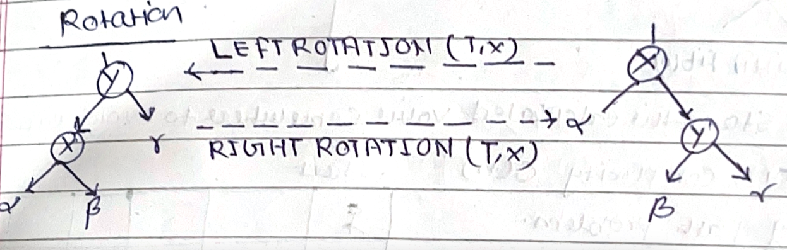

- [Tree](#tree)
  - [Binary Search Tree](#binary-search-tree)
  - [AVL Tree](#avl-tree)
  - [Red Black Tree](#red-black-tree)

##  Binary Search Tree

referred coreman book and https://www.youtube.com/watch?v=oSWTXtMglKE&t=238s
#### Binary search tree property
```

15
/  \
6   18
/\   / \
3  7 17  20
/\   \
2  4  13
/
9
Let x be a node in binary search tree. If y is a node in the left substree of x, then y.key<= x.key. 
If y is a node in the right subtree of x, then y.key>= x.key
```

#### Tree Traversal ```BinarySearchTreeTraversal.java```
- Inorder (print the key in sorted order)
```
InOrder-Tree-Walk(x)
1. if(x!=null)
2.    InOrder-Tree-Walk(x.left)
3.    print key
4.    InOrder-Tree-Walk(x.right)
```
- Preorder
```
Preorder-Tree-Walk(x)
1. if(x!=null)
2.    print key
3.    Preorder-Tree-Walk(x.left)
4.    Preorder-Tree-Walk(x.right)
```
- postorder

```
postorder-Tree-Walk(x)
1. if(x!=null)
2.   postorder-Tree-Walk(x.left)
3.   postorder-Tree-Walk(x.right) 
4.   print key 
```
###### Complexity
- Time Complexity O(n) 
- Space Complexity O(1) if we do not consider function calls else O(h) where h is the height of the tree.

#### Searching, Finding Min, Max, Predecessor, and successor
##### Searching- recursive
```
tree-search(x,k)
1. if x == null || k ==x.key
2.    return x
3. if k<x.key
4.    return tree-search(x.left,k)
5. else return tree-search(x.right,k)
```
##### Searching- iterative
```
tree-search(x,k)
1. while x !=null && x.key != k
2.     if k < x.key
3.          x = x.left
4.     else x= x.right
5. return x
```

##### Minimum and Maximum
```
Min(x)
1. while x.left != null
2.      x = x.left
3. return x

Max(x)
1. while x.right != null
2.      x = x.right
3. return x
```

##### Successor and Predecessor
```
Successor-> successor of node x is the node with the smallest key greater than x.key.

Tree-Successor(x)
1. if x.right != null  //if right subtree of the tree is nonempty
2.    return Tree-Minimum(x.right)
3. y=x.p
4. while y!=null and x==y.right
5.        x = y
6.        y = y.p
7 return y

Predecessor-> The inorder predecessor of a node in a Binary Search Tree is the node that comes before our key node
example. inorder traversal of given tree 2,3,4,6,7,9,13,15,17,18,20. predecessor of 4 is 3, successor of 15 is 17
```
Complexity O(n) worst case if tree is unbalanced.

##  AVL Tree
- **Rotation**  just for understanding how i have implemented we can consider (bita(B) = T)
-  </img>
- **Complexity** O(log n)
 Limitation with binary search tree is that,it could be unbalanced depending on the insertion sequence.


##  Red Black Tree

- **Complexity** Insert, delete and search = O(log n)

- AVL tree is more balanced if we compare it with red black tree. But they may cause more rotations during insertions and deletions.
If your application is involved more insertions and deletions then u can prefer red black tree
- **Red Black Tree Properties**
   - Each node is either red or black
   - Root of the tree is always black
   - Red node can not have red children
   - Every path from a node to its descendant null nodes has the same number of black nodes.
   - All leaves (null node) are black.


