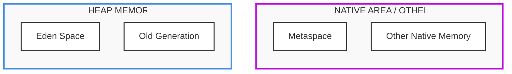

- [JVM Memory](#jvm-memory)

# JVM Memory

```mermaid
graph LR
%% Simple layout style for clear boxes
    classDef clearBox font-size:18px,fill:#fff,stroke:#333,stroke-width:2px;

%% 1. Managed Heap Area (Rendered on Left)
    subgraph Heap [HEAP MEMORY]
        Eden[Eden Space]:::clearBox
        OldGen[Old Generation]:::clearBox
    end

%% 2. Native Area (Rendered on Right)
    subgraph Native [NATIVE AREA / OTHERS]
        Metaspace[Metaspace]:::clearBox
        Others[Other Native Memory]:::clearBox
    end

%% Invisible line to force Heap to stay on the LEFT of Native Memory
    Heap ~~~ Native

%% Container styling
    style Heap fill:#f9f9f9,stroke:#4a90e2,stroke-width:3px,font-size:18px;
    style Native fill:#f9f9f9,stroke:#bd10e0,stroke-width:3px,font-size:18px;
```
